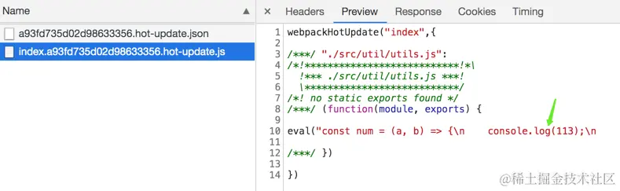

## Webpack 热更新 (HMR) 原理

### 概述
`Hot Module Replacement`，简称`HMR`。

在 `Hot Module Replacement` 之前，应用的加载、更新都是一种页面级别的操作，即使只是单个代码文件发生变更，都需要刷新整个页面，才能将最新代码映射到浏览器上，这会丢失之前在页面执行过的所有交互与状态，例如：
- 对于复杂表单场景，这意味着你可能需要重新填充非常多字段信息
- 弹框消失，你必须重新执行交互动作才会重新弹出

所以，再小的改动，例如更新字体大小，改变备注信息都会需要整个页面重新加载执行，整体开发效率偏低。

而引入 HMR 后，虽然无法覆盖所有场景，但大多数小改动都可以通过模块热替换方式更新到页面上，因此 HMR 可以节省宝贵的开发时间、提升开发体验。

在 `Webpack` 中也内置了 HMR 的功能，可以通过`HotModuleReplacementPlugin` 或 `--hot`开启

### 热更新核心思想
热更新的核心包 [webpack-dev-server](https://www.npmjs.com/package/webpack-dev-server) 做了哪些事：

1. 往客户端代码中添加两个文件
当我们运行 `webpack serve` 后，`webpack-dev-server` 会先往客户端代码中添加两个文件。两个文件的目的：
    - websocket 相关的代码，用来跟服务端通信
    - 客户端接收到最新代码后，更新代码

2. 启动两个服务
接着会帮我们启动两个服务：
    - 本地 `HTTP` 服务
    
    这个服务会给我们提供编译之后的记过，之后浏览器通过端口请求时，就会请求本地服务中编译之后的内容，默认端口号 8080

    - `websocket` 双向通信服务器

    如果有新的模块发生变化，编译成功会以消息的方式通知客户端，让客户端来请求最新代码，并进行客户端的热更新

3. 以 watch 模式开始编译，结束后生成唯一 hash 值

    然后会以 [watch](https://webpack.js.org/configuration/watch/#watch) 模式 开始编译，每次编译结束后会生成一个唯一的 hash 值。

    watch 模式
    > 使用监控模式开始启动 `webpack` 编译，在 `webpack` 的 `watch` 模式下，文件系统中某一个文件发生修改，`webpack` 监听到文件变化，根据配置文件对模块重新编译打包，每次编译都会产生一个唯一的 hash 值

#### 首次启动
在初次编译完成（启动项目）后，`webpack` 内部会生成一个 `hash = h1`，并将 `hash = h1 `通过 websocket 的方式通知给客户端，客户端上有两个变量：lastHash、currentHash。

- lastHash：上一次接收到的 hash
- currentHash：这一次接收到的 hash

在接收到服务端通知过来的 `hash` 时，客户端会进行保存：
```js
lastHash= "之前的hash值"
currentHash = hash
```
如果是第一次接收到 hash 值，代表是第一次连接，则：
```js
/******/
/******/
/* webpack/runtime/getFullHash */
/******/
(()=>{  
    /******/
    __webpack_require__.h = ()=>("37a9031962fdd2fb6b51")
    /******/
}
)();
// first not hash
let lastHash = currentHash = '37a9031962fdd2fb6b51'


// second 
lastHash = currentHash
currentHash = 'fd149cd96b105c6c0b25'
```
#### 二次编译
> tips: 下文出现的 h1 和 h2 均可看成变量

此时，如果源代码发生变化，`webpack `对源文件重新进行编译，在编译完成后生成 `hash = h2` ，并将 `hash = h2` 发送给客户端，客户端接收到消息后，修改自身的变量：
```js
//客户端代码
lastHash = h1
currentHash = h2
```
接着客户端通过 `lastHash = h1` 向服务端请求 `json` 数据`（main.h1.json）`，目的是为了获得 变更的代码块：


客户端在收到响应后，知道了哪些代码块发生了变化，接着会继续通过 `lastHash = h1``（main.h1.js）`向服务端去请求 变更代码块`（chunk：main）`中的变动模块代码。

服务端接收到 `js` 请求`（main.h1.js）`后，将传过来的 `h1` 和 自身最新的 `hash = h2 `再次进行对比，找出具体 变更的模块代码`（src/name.js）` 后返回给客户端。

最后，客户端拿到了变更模块的代码，重新去执行依赖该模块的模块（比如 `src/name.js` 被修改了，`src/index.js` 依赖 `src/name.js`，那就要重新执行 `src/index.js` 这个模块），达到更新的目的。

#### why set currentHash and lastHash
- 为什么客户端要设计两个 hash 值：上一次接受到的lastHash & 这一次接收到的currentHash

因为服务端其实并不知道客户端的 hash 是多少，万一此时又连接一个客户端（多窗口的场景）怎么办？所以这里需要客户端将上一次的 hash 返回给服务端，服务端通过比较后才返回变更的代码块

- 每次文件改变都要重新编译，性能是不是不太好？

为了提升性能，[webpack-dev-server](https://www.npmjs.com/package/webpack-dev-server)使用了一个库叫 [memfs](https://www.npmjs.com/package/memfs)，是 Webpack 官方写的。这样每次打包之后的结果并不会进行输出（把文件写入到硬盘上会耗费很长的时间），而是将打包后的文件保留在内存中，以此来提升性能。

### 热更新源码解析
#### 1. `webpack-dev-server`源码是如何实现热更新的？

1. webpack-dev-server启动本地服务

根据 `webpack-dev-server` 的 `package.json` 中的 `bin` 命令，可以找到命令的入口文件 `bin/webpack-dev-server.js`
```js
// node_modules/webpack-dev-server/bin/webpack-dev-server.js

// 生成webpack编译主引擎 compiler
let compiler = webpack(config);

// 启动本地服务
let server = new Server(compiler, options, log);
server.listen(options.port, options.host, (err) => {
    if (err) {throw err};
});

```
2. 本地服务代码：
```js
 // node_modules/webpack-dev-server/lib/Server.js
class Server {
    construstor() {
        this.setupApp();
        this.createServer();
    }

    setupApp() {
        // 依赖了 express
        this.app = new express();
    }

    createServer() {
        this.listeningApp = http.createServer(this.app);
    }

    listen(port, hostname, fn) {
        return this.listeningApp.listen(port, hostname, err) => {
            // 启动 express 服务后，启动 websocket 服务
            this.createSocketServer();
        }
    }
}
```
这段代码主要工作：

1. 启动 `webpack`, 生成 `compiler` 实例。
    > `compiler`上有很多方法，比如可以启动 `webpack` 所有编译工作，以及监听本地文件的变化。
2. 使用 `express` 框架启动本地 `server`，让浏览器可以请求本地的静态资源
3. 本地`server`启动之后，再去启动`websocket`服务，通过`websocket`，可以建立本地服务和浏览器的双向通信。这样就可以实现当本地文件发生变化，立马告知浏览器可以热更新代码啦！

#### 2. 修改 webpack.config.js 的 entry 配置
其实在启用本地服务前，`webpack-dev-server/lib/Server.js`调用了`addAdditionalEntries(compiler)`方法。这个方法中有 2 段关键性代码。一个是获取websocket客户端代码路径，另一个是根据配置获取webpack热更新代码路径。
```js
addAdditionalEntries(compiler) {
    const additionalEntries = [];

    webSocketURLStr = searchParams.toString();
    // ....
     additionalEntries.push(
        `${require.resolve("../client/index.js")}?${webSocketURLStr}`,
      );

    // ....
    if (this.options.hot === "only") {
      additionalEntries.push(require.resolve("webpack/hot/only-dev-server"));
    } else if (this.options.hot) {
      additionalEntries.push(require.resolve("webpack/hot/dev-server"));
    }
    // ....
}
```
修改后的 `webpack` 入口配置如下：
```js
// 修改后的 entry 入口
{
    entry: {
        index: [
            // 上面获取的clentEntry
            'xxx/node_modules/webpack-dev-server/client/index.js?http://localhost:8080',
            // 上面获取的hotEntry
            'xxx/node_modules/webpack/hot/dev-server.js',
            // 开发配置的入口
            './src/index.js'
        ]
    }
}
```
为什么要新增2个文件？在入口默默增加了2个文件，那就意味会一同打包到 `bundle` 文件中去，也就是线上运行时。
- webpack-dev-server/client/index.js

这个文件是用于 `websocket` 的，因为 `websocket` 是双向通信，我们在第 1 步`webpack-dev-server`初始化 的过程中，启动的是本地服务端的`websocket`。那客户端也就是我们的浏览器，浏览器还没有和服务端通信的代码呢？因此我们需要把`websocket`客户端通信代码放到我们的代码中。

- webpack/hot/dev-server.js

用于检查更新逻辑
#### 3. 监听 webpack 编译结束
修改好入口配置后，又调用了`setupHooks` 方法，用来注册监听事件的，监听每次 `webpack` 时间编译完成
```js
 // node_modules/webpack-dev-server/lib/Server.js
// 绑定监听事件
setupHooks() {
    this.compiler.hooks.invalid.tap("webpack-dev-server", () => {
        if (this.webSocketServer) {
        this.sendMessage(this.webSocketServer.clients, "invalid");
        }
    });
    this.compiler.hooks.done.tap(
        "webpack-dev-server",
        /**
         * @param {Stats | MultiStats} stats
         */
        (stats) => {
        if (this.webSocketServer) {
            this.sendStats(this.webSocketServer.clients, this.getStats(stats));
        }

        /**
         * @private
         * @type {Stats | MultiStats}
         */
        this.stats = stats;
        },
    );
}
```
当监听到一次 `webpack` 编译结束，就会调用 `_sendStaus` 方法通过 `websocket` 给浏览器发送通知，`ok` 和 `hash` 事件，这样浏览器就可以拿到最新的 `hash` 值了，做检查更新逻辑。
```js
// 通过 websocket 给客户端发消息
sendStats(clients, stats, force) {
    // ....
    this.currentHash = stats.hash;
    this.sendMessage(clients, "hash", stats.hash);

    // ....
    this.sendMessage(clients, "ok");
}

sendMessage(clients, type, data, params) {
    for (const client of clients) {
      // `sockjs` uses `1` to indicate client is ready to accept data
      // `ws` uses `WebSocket.OPEN`, but it is mean `1` too
      if (client.readyState === 1) {
        client.send(JSON.stringify({ type, data, params }));
      }
    }
}
```
#### 4. webpack 监听文件变化
每次修改代码就会触发编译，说明我们还需要监听本地代码的变化，主要通过 `setupDevMiddleware` 方法实现的

这个方法主要执行了 `webpack-dev-middleware` 库。很多人分不清`webpack-dev-middleware` 和 `webpack-dev-server` 的区别。其实就是因为`webpack-dev-server`只负责启动服务和前置准备工作，所有文件相关的操作都抽离到`webpack-dev-middleware`库了，主要是本地文件的编译和输出以及监听，无非就是职责的划分更清晰了。
```js
function wdm(compiler, options = {}) {

    const context = {
        state: false,
        // eslint-disable-next-line no-undefined
        stats: undefined,
        callbacks: [],
        options,
        compiler,
        logger: compiler.getInfrastructureLogger("webpack-dev-middleware")
    };
    setupHooks(context);
    if (options.writeToDisk) {
        setupWriteToDisk(context);
    }
    setupOutputFileSystem(context); // write local

    const errorHandler = error => {
      if (error) {
        context.logger.error(error);
      }
    };

   if (Array.isArray( /** @type {MultiCompiler} */context.compiler.compilers)) {
      const c = /** @type {MultiCompiler} */context.compiler;
      const watchOptions = c.compilers.map(childCompiler => childCompiler.options.watchOptions || {});
      context.watching = compiler.watch(watchOptions, errorHandler);
    } else {
      const c = /** @type {Compiler} */context.compiler;
      const watchOptions = c.options.watchOptions || {};
      context.watching = compiler.watch(watchOptions, errorHandler);
    }

    // watch:  `compiler.watch(watchOptions, errorHandler);`
    // write:setupOutputFileSystem(context);
}
```
1. 调用了 comiler.watch 方法

在第 1 步中也提到过 `compiler` 的强大。这个方法主要就做了两件事：

首先对本地文件代码进行编译打包，也就是 `webpack` 的一系列编译流程。
其次编译结束后，开启对本地文件的监听，当文件发生变化，重新编译，编译完成之后继续监听

为什么代码的改动保存会自动编译，重新打包？这一系列的重新检测编译就归功于`compiler.watch`这个方法了。监听本地文件的变化主要是通过文件的生成时间是否有变化。

2. 执行 setFs 方法

这个方法主要目的就是将编译后的文件打包到内存。这就是为什么在开发的过程中，你会发现 `dist` 目录没有打包后的代码，因为都在内存里。存在内存的原因在于访问内存中的代码比访问文件系统中的文件更快，而且也减少了代码写入文件的开销，这一切都归功于`memory-fs`。

#### 5. 浏览器接收到热更新的通知

我们已经可以监听到文件的变化了，当文件发生变化，就触发重新编译。同时还监听了每次编译结束的事件。当监听到一次`webpack`编译结束，_`sendStats`方法就通过`websoket`给浏览器发送通知，检查下是否需要热更新。下面重点讲的就是`sendStats`方法中的`ok`和`hash`事件都做了什么。

浏览器是如何接收到 `websocket` 的消息呢？第 2 步骤增加的入口文件，也就是`websocket`客户端代码。
```js
'xxx/node_modules/webpack-dev-server/client/index.js?http://localhost:8080'
```
这个文件的代码会被打包到 `bundle.js` 中，运行在浏览器中。核心代码如下：
```js
 // webpack-dev-server/client/index.js
var socket = require('./socket');
var onSocketMessage = {
     hash: function hash(_hash) {
        status.previousHash = status.currentHash;
        status.currentHash = _hash;
    },
    ok: function ok() {
        sendMessage("Ok");
        if (options.overlay) {
        overlay.send({
            type: "DISMISS"
        });
        }
        reloadApp(options, status);
    },
}

function reloadApp(options, status) {
  if (hot && allowToHot) {
    log.info("App hot update...");
    hotEmitter.emit("webpackHotUpdate", status.currentHash);
    if (typeof self !== "undefined" && self.window) {
      // broadcast update to window
      self.postMessage("webpackHotUpdate".concat(status.currentHash), "*");
    }
  }
}

```
`socket`方法建立了`websocket`和服务端的连接，并注册了 2 个监听事件。
- `hash`事件，更新最新一次打包后的`hash`值。
- `ok`事件，进行热更新检查。

热更新检查事件是调用`reloadApp`方法。比较奇怪的是，这个方法又利用`node.js的EventEmitter`，发出`webpackHotUpdate`消息。这是为什么？为什么不直接进行检查更新呢？

可能就是为了更好的维护代码，以及职责划分的更明确。`websocket` 仅仅用于客户端（浏览器）和服务端进行通信，而真正做事情的活还是交回给了 `webpack`。

那`webpack怎`么做的呢？第 2 步中入口文件还有一个文件没有讲到，就是：
```js
'xxx/node_modules/webpack/hot/dev-server.js'
```
这个文件的代码同样会被打包到`bundle.js`中，运行在浏览器中。
```js
var check = function check() {
		module.hot
			.check(true)
			.then(function (updatedModules) {
				if (!updatedModules) {
					if (typeof window !== "undefined") {
						window.location.reload();
					}
					return;
				}

				if (!upToDate()) {
					check();
				}

				require("./log-apply-result")(updatedModules, updatedModules);

				if (upToDate()) {
					log("info", "[HMR] App is up to date.");
				}
			})
			.catch(function (err) {
				// ....
			    window.location.reload();
				
			});
	};
	var hotEmitter = require("./emitter");
	hotEmitter.on("webpackHotUpdate", function (currentHash) {
		lastHash = currentHash;
		if (!upToDate() && module.hot.status() === "idle") {
			check();
		}
	});
```
这里`webpack`监听到了`webpackHotUpdate`事件，并获取最新了最新的hash值，然后终于进行检查更新了。检查更新呢调用的是`module.hot.check`方法。那么问题又来了，`module.hot.check`又是哪里冒出来了的！答案是`HotModuleReplacementPlugin`

#### 6. HotModuleReplacementPlugin

在这一步，其实是 `webpack` 中三个模块（三个文件，后面英文名对应文件路径）之间配合的结果

首先是 `webpack/hot/dev-server（以下简称 dev-server）` 监听第三步 `webpack-dev-server/client` 发送的 `webpackHotUpdate` 消息，调用 `webpack/lib/HotModuleReplacement.runtime`（简称 HMR runtime）中的 `check` 方法，检测是否有新的更新，

在 `check` 过程中会利用 `webpack/lib/JsonpMainTemplate.runtime`（简称 `jsonp runtime`）中的两个方法 `hotDownloadUpdateChunk` 和 `hotDownloadManifest` ，

第二个方法是调用 `AJAX` 向服务端请求是否有更新的文件，如果有将发更新的文件列表返回浏览器端，而第一个方法是通过 `jsonp` 请求最新的模块代码，然后将代码返回给 `HMR runtime`，`HMR runtime` 会根据返回的新模块代码做进一步处理，可能是刷新页面，也可能是对模块进行热更新。

####  7. moudle.hot.check 开始热更新
通过第 6 步，我们就可以知道 `moudle.hot.check` 方法是如何来的啦。那都做了什么？之后的源码都是 `HotModuleReplacementPlugin` 塞入到 `bundle.js `中的就不写文件路径了。

- 利用上一次保存的 hash 值， 调用 `hotDownloadMainfest` 发送 `xxx/hash.hot-update.json`的`ajax`请求；
- 请求结果获取的热更新模块以及下次热更新的 `Hash` 标识，并进入热更新准备阶段。
```js
hotAvailableFilesMap = update.c;// 需要更新的文件
hotUpdateNewHash = update.h;// 更新下次热更新的hash值
hotSetStatus('prepare');//进入热更新准备状态
```
- 调用 `hotDownloadUpdateChunk` 发送 `xxx/hash.hot-update.js` 请求，通过 `JSONP` 方式
```js
function hotDownloadUpdateChunk(chunkId) {
    var script = document.createElment("script");
    script.charset = 'utf-8';
    script.src = __webpack_require__.p + "" + chunkId + "." + hotCurrentHash + ".hot-update.js";
    if(null) script.crossOrigin = null;
    document.head.appendChild(script);
}

```
这个函数体为什么要单独拿出来，因为这里要解释下为什么使用JSONP获取最新代码？主要是因为`JSONP`获取的代码可以直接执行。为什么要直接执行？我们来回忆下`/hash.hot-update.js`的代码格式是怎么样的。



```js
"use strict";
self["webpackHotUpdatewebpack_hmr"]("main",{

/***/ "./src/content.js":
/*!************************!*\
  !*** ./src/content.js ***!
  \************************/
/***/ ((__unused_webpack_module, __webpack_exports__, __webpack_require__) => {

__webpack_require__.r(__webpack_exports__);
/* harmony export */ __webpack_require__.d(__webpack_exports__, {
/* harmony export */   "default": () => (__WEBPACK_DEFAULT_EXPORT__)
/* harmony export */ });
let content = "hello world221"
console.log("welcome");
/* harmony default export */ const __WEBPACK_DEFAULT_EXPORT__ = (content);

/***/ })

},
/******/ function(__webpack_require__) { // webpackRuntimeModules
/******/ /* webpack/runtime/getFullHash */
/******/ (() => {
/******/ 	__webpack_require__.h = () => ("9d3bdf1c0f0341a2053e")
/******/ })();
/******/ 
/******/ }
);
```

从图可见，新编译后的代码是在一个`webpackHotUpdatewebpack_hmr`函数体内部的。也就是要立即执行`webpackHotUpdatewebpack_hmr`这个方法。

再看`webpackHotUpdatewebpack_hmr`这个方法
```js
__webpack_require__.o = (obj, prop) => (Object.prototype.hasOwnProperty.call(obj, prop))
self["webpackHotUpdatewebpack_hmr"] = (chunkId, moreModules, runtime) => {
                    // 更新的模块moreModules赋值给全局全量hotUpdate
/******/ 			for(var moduleId in moreModules) {
/******/ 				if(__webpack_require__.o(moreModules, moduleId)) {
/******/ 					currentUpdate[moduleId] = moreModules[moduleId];
/******/ 					if(currentUpdatedModulesList) currentUpdatedModulesList.push(moduleId);
/******/ 				}
/******/ 			}
/******/ 			if(runtime) currentUpdateRuntime.push(runtime);
                     // 调用hotApply进行模块的替换
/******/ 			if(waitingUpdateResolves[chunkId]) {
/******/ 				waitingUpdateResolves[chunkId]();
/******/ 				waitingUpdateResolves[chunkId] = undefined;
/******/ 			}
/******/ 		};
```
```js
var waitingUpdateResolves = {};
/******/ 		function loadUpdateChunk(chunkId, updatedModulesList) {
/******/ 			currentUpdatedModulesList = updatedModulesList;
/******/ 			return new Promise((resolve, reject) => {
/******/ 				waitingUpdateResolves[chunkId] = resolve;
/******/ 				// start update chunk loading
/******/ 				var url = __webpack_require__.p + __webpack_require__.hu(chunkId);
/******/ 				// create error before stack unwound to get useful stacktrace later
/******/ 				var error = new Error();
/******/ 				var loadingEnded = (event) => {
/******/ 					if(waitingUpdateResolves[chunkId]) {
/******/ 						waitingUpdateResolves[chunkId] = undefined
/******/ 						var errorType = event && (event.type === 'load' ? 'missing' : event.type);
/******/ 						var realSrc = event && event.target && event.target.src;
/******/ 						error.message = 'Loading hot update chunk ' + chunkId + ' failed.\n(' + errorType + ': ' + realSrc + ')';
/******/ 						error.name = 'ChunkLoadError';
/******/ 						error.type = errorType;
/******/ 						error.request = realSrc;
/******/ 						reject(error);
/******/ 					}
/******/ 				};
/******/ 				__webpack_require__.l(url, loadingEnded);
/******/ 			});
/******/ 		}
```

#### 8. hotApply 热更新模块替换
- 删除过期的模块，就是需要替换的模块
```js
var queue = outdatedModules.slice();
while (queue.length > 0) {
    moduleId = queue.pop();
    // 从缓存中删除过期的模块
    module = installedModules[moduleId];
    // 删除过期的依赖
    delete outdatedDependencies[moduleId];
    
    // 存储了被删掉的模块id, 便于更新代码
    outdateSelfAcceptedModules.push({
        module: moduleId
    })
}

```
- 将新的模块添加到 modules 中
```js
appliedUpdate[moduleId] = hotUpdate[moduleId];
for (moduleId in appliedUpdate) {
    if (Object.prototype.hasOwnProperty.call(appliedUpdate, moduleId)) {
        modules[moduleId] = appliedUpdate[moduleId];
    }
}
```
- 通过__webpack_require__执行相关模块的代码
```js
for (i = 0; i < outdatedSelfAcceptedModules.length; i++) {
    var item = outdatedSelfAcceptedModules[i];
    moduleId = item.module;
    try {
        // 执行最新的代码
        __webpack_require__(moduleId);
    } catch (err) {
        // ...容错处理
    }
}
```
### 


## 参考

[Webpack HMR 原理解析](https://zhuanlan.zhihu.com/p/30669007)

[Webpack Hot Module Replacement 的原理解析](https://github.com/Jocs/jocs.github.io/issues/15)

[看完这篇，面试再也不怕被问 Webpack 热更新](https://juejin.cn/post/6844903953092591630#heading-4)

[从零实现webpack热更新HMR](https://juejin.cn/post/6844904020528594957#heading-6)

[Webpack深度进阶：两张图彻底讲明白热更新原理！](https://juejin.cn/post/7176963906844246074)